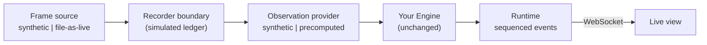

# Live Session Workstream — Overview for Review

**Author:** Saleh BinHadib (live-session workstream)
**Reviewer:** Fahad (analysis owner)
**Base:** `f7a10/child-therapy-aba-demo` `main` @ `606363a`
**Status:** proposal and reference prototype. **Nothing here is accepted until
you review it.** Synthetic and precomputed data only: no camera, no model
inference, no real footage, nothing recorded.

This file explains everything in this repository that is new compared with
your `main`: what was built, why, how to run it, what is verified and what is
not, and which decisions are yours. Start here, then read the
[design document](docs/live-session-design.md).

---

## 1. TL;DR

- I followed the Track B scope: a **separate live-session layer** around your
  existing analysis. **None of your files were modified**; all 172 of your
  tests still pass.
- New code lives in `aba_demo/live/` (Python) and `live-ui/` (web page), with
  its own tests (53 Python, 9 frontend).
- It runs sessions from **synthetic scripts** or by **replaying your
  precomputed export against its video** (file-as-live), feeds the rows into
  **your `Engine` unchanged**, and streams the results to a therapist-facing
  live view.
- Every failure and delay is visible: identity loss, source end/disconnect,
  analysis errors, slow analysis (results marked late, never skipped),
  recorder failure, lost connection.
- **Process note:** the scope asked for a design-only PR first. I built a
  working prototype to check the design was feasible before proposing it. It
  is offered as a reference for your decision, split into small draft PRs;
  every technology and interface choice in it is open (see [§9](#9-decisions-that-are-yours)).

---

## 2. How to review (suggested order)

| Order | Branch | What it contains | Size |
| --- | --- | --- | --- |
| 1 | `docs/live-design` | Design document only | 1 file |
| 2 | `feat/live-core` | Draft 1/3 — Python core, no new dependencies | 8 files |
| 3 | `feat/live-api` | Draft 2/3 — local API + WebSocket (stacked on 2) | 5 files |
| 4 | `feat/live-ui` | Draft 3/3 — live web page (stacked on 3) | 26 files |
| — | `main` (this repo) | Everything combined + this overview, ready to run | — |
| — | `upstream-main` | Your `main` exactly as I started from it | — |

Branches 1–4 are based on your `main` and can be opened as PRs against your
repository in that order. This repository's `main` exists only to make the
whole thing easy to run and read.

---

## 3. Run it (about 3 minutes)

Requirements: Python 3.11+ and Node 22+ (tested with Python 3.13 and Node 24 on Windows 11). From the
repository root:

```bash
python -m venv .venv
.venv/Scripts/python -m pip install -r requirements-live.txt   # macOS/Linux: .venv/bin/python
cd live-ui && npm ci && npm run build && cd ..
.venv/Scripts/python -m aba_demo.live
```

Open <http://127.0.0.1:8767>, pick a scenario, then **Open source → click
the child (or Lock target) → Start session**.

**Replay one of your exports as if live** (local only, checked by SHA-256 at
startup, the video is decoded locally and never displayed or uploaded):

```bash
.venv/Scripts/python -m aba_demo.live --replay-video path/to/video.mp4 --replay-observations path/to/observations.json
```

**Tests:**

```bash
.venv/Scripts/python -m unittest discover -s tests -v   # 225 tests
cd live-ui && npm test                                  # 9 tests
```

Without `requirements-live.txt`, the API tests skip; without OpenCV, the 4
file-as-live tests skip. Your lightweight suite is unaffected either way.

---

## 4. What the user sees

1. **Launcher** — three principles (therapist selects the child; unobservable
   ≠ absent; candidates, not conclusions) and eight synthetic scenarios, plus
   the precomputed replay when configured.
2. **Session view**
   - A badge that always states the data origin: **SIMULATION** or
     **PRECOMPUTED REPLAY**.
   - A stage (abstract, clearly labeled "no video") where the therapist
     **explicitly locks the target** before anything is observed. Identity
     state is always shown; when uncertain, everything is suppressed.
   - Lifecycle controls: open, lock, start, pause/resume (Space), end (with
     confirmation). "All scenarios" returns home; leaving a running session
     asks first and ends it on the server.
   - Five indicator tiles using your Engine's states. **"Not observable"
     (hatched) is visually distinct from "Observed · none".**
   - One peripheral **candidate card**, taken only from `Engine.update`'s
     `alert`. It is withdrawn when identity is uncertain, the stream is
     interrupted, analysis is late, or the session ends.
   - Activity context (table / movement / break), event log, and session facts
     (recorder ledger, analysis p95, late results).
   - End-of-session summary stating that no video was recorded and whether the
     frame ledger was verified.
3. **Failure states** — stale/interrupted stream banner, "session no longer
   available" after a server restart, analysis-behind-live banner, failed
   session summary.

Attention uses amber; red is reserved for system failures, never for
behavior. Light/dark and reduced-motion preferences are respected.

---

## 5. Architecture



| Module | Responsibility |
| --- | --- |
| `aba_demo/live/source.py` | `SyntheticFrameSource` (EOF/disconnect injection); `FileAsLiveSource` (local file, nominal-FPS time, same CFR assumption as `VideoAnalyzer`, OpenCV optional) |
| `aba_demo/live/providers.py` | `SyntheticProvider` (scripted rows, failure and cost injection); `PrecomputedProvider` (validates your export, binds it to the video by SHA-256, emits rows causally) |
| `aba_demo/live/recorder.py` | `FrameLedgerRecorder`: simulated recorder that ledgers frame indices (no pixels), counts gaps, hashes the ledger, injects write/finalize failures |
| `aba_demo/live/session.py` | Lifecycle state machine, real-time pacing, recorder-before-analysis, stale marking, performance events, event envelopes |
| `aba_demo/live/scenarios.py` | Eight synthetic scenarios and the optional precomputed replay |
| `aba_demo/live/runtime.py` | Asyncio runtime: frame work in a worker thread under a per-session lock; bounded event history; resume by sequence |
| `aba_demo/live/api.py`, `__main__.py` | Loopback FastAPI app: scenarios, sessions, commands, WebSocket stream; host/origin checks, security headers |
| `live-ui/` | React + TypeScript + Vite + Tailwind page; state reducer with tests |

What the prototype consumes from your code: `engine.Engine` and
`engine.INDICATORS`, `export.file_sha256`, and the exported document shape.
Nothing else is imported, and nothing of yours is modified.

---

## 6. Rules the code enforces

| Rule (from your handoff) | How it is enforced | Test |
| --- | --- | --- |
| No observations before the therapist selects the target | Session state machine | `test_no_observations_before_start` |
| Uncertain identity ⇒ five `null` signals | Provider validation + session contract check; violations fail the worker | `test_contract_violation_fails_worker`, precomputed validation tests |
| `null` is unobservable, not absent | Separate UI state and styling | `test_identity_loss_is_unobservable_not_absent` |
| Alerts only from the Engine | UI reads `engine_state.alert` only | `test_alert_comes_from_engine_after_persistence`, reducer tests |
| Never fabricate results on failure | Provider errors emit an error event and no row | `test_provider_failure_emits_error_and_no_fabricated_row` |
| No future results | Frames processed only when due; future rows fail the worker | `test_only_elapsed_frames_are_emitted`, `test_future_rows_fail_the_worker` |
| Never skip frames before analysis | Every due frame is recorded then analysed; late results marked stale | `test_slow_analysis_ages_and_marks_results_stale_without_skipping` |
| Never show old results as current | Stale/late, interrupted or lost states withdraw the card | reducer tests, manual checks |
| No false recording claim | Completion only after ledger finalize; failures end in `failed`; `recorded: false` always | recorder tests |
| Precomputed must match the video | SHA-256 binding at load | `test_rejects_mismatched_video`, `test_replay_scenario_validates_the_pair` |
| Local only | Loopback bind, host allowlist, origin checks | API tests |

---

## 7. Scenarios

| Scenario | Exercises |
| --- | --- |
| Table routine | Persistence, candidate alerts, cooldown, opt-in hand motion |
| Leaves seat | Alert priority, out-of-seat suppression, posture pulses |
| Brief occlusion | Identity uncertainty, signal suppression, episode closure |
| Partial visibility | Per-indicator observability, null ≠ false |
| Analysis failures | Provider errors, observation gaps |
| Source disconnect | Source failure, terminal state |
| Slow analysis | Analysis lag, stale marking, performance telemetry |
| Recorder failure | Recorder failure, no false completion |
| Precomputed replay (optional) | File-as-live source, your export, hash binding |

All synthetic scripts are labeled as such and do not represent real child
behavior.

---

## 8. Verification

**Automated:** 225 Python tests pass (172 yours unchanged + 53 new), 9
frontend tests pass, TypeScript strict type-check passes. Each draft branch
passes the full suite on its own.

**Manual (browser, synthetic data):** every scenario run end to end; timings
checked against scripts (e.g. orientation onset 8.0 s, evidence 10.0 s, end
13.0 s); identity loss suppresses everything; server stop shows the stale
banner; server restart shows "session no longer available"; slow analysis
shows "2.8 s behind live"; recorder failure fails at 12 s with no ledger;
precomputed replay decodes a generated synthetic video and replays rows on
time; light and dark modes.

**Bugs found during manual testing and fixed:** latency counted read-ahead
wait time; float error delayed frames by one tick; reconnect looped forever
when a session was gone; browser served a stale UI bundle after an update
(HTML now `no-cache`, unknown events ignored); encoding issue in one file.

**Not verified / not claimed:** real camera capture, live model inference,
real-time throughput of `VideoAnalyzer`, real recording, clinical validity,
multi-user operation, production security.

---

## 9. Decisions that are yours

| # | Decision | Prototype default (changeable) |
| --- | --- | --- |
| 1 | Accept `aba_demo/live/` + separate entry point as the boundary | As built |
| 2 | Provider protocol `observe(frame) -> list[row]` and the analyzer adapter plan | As built; adapter not started |
| 3 | Event envelope fields, transport, versioning | WebSocket + `sequence` resume |
| 4 | Stale threshold and whether any drop policy is allowed | 1.0 s, no dropping |
| 5 | Backend framework | FastAPI (alternative: standard library + SSE, zero new deps) |
| 6 | Frontend stack | React/Vite/Tailwind (alternative: single static page) |
| 7 | Pause/preview recording semantics, real recorder | Open — needs product/privacy decision |
| 8 | Therapist-facing wording and interruption level | Pending clinician review |
| 9 | Hardware and media for the analyzer lag experiment | Needs authorized footage or a person-like synthetic clip |

---

## 10. Findings about the existing code (nothing changed)

1. **Engine persistence fires one sample late.** Durations accumulate float
   deltas, so at 5 Hz `0.2 × 10` stays below `2.0`; a candidate starting at
   6.2 s activates at 8.4 s instead of 8.2 s.
2. **Possibly flaky test.** `test_demo_server.ServerTests.test_context_validate_rejects_invalid_headers_json_schema_and_security`
   failed once on Windows (1 of 6 full runs on the prototype branch, 0 of 5 on
   `main`, 0 of 12 targeted reruns). It does not import the live package.

---

## 11. Privacy and scope

- No real recordings, frames, names, notes, credentials, model weights, or
  generated session data are in this repository. Test media are generated in
  temporary folders and deleted.
- The private team handoff documents are **not** copied here; this overview
  and the design document are written independently.
- `package.json`, `package-lock.json` and `tsconfig.json` were added
  explicitly because the repository `.gitignore` ignores `*.json`; they
  contain no data.
- The prototype makes no network requests beyond the local machine; fonts are
  bundled.
