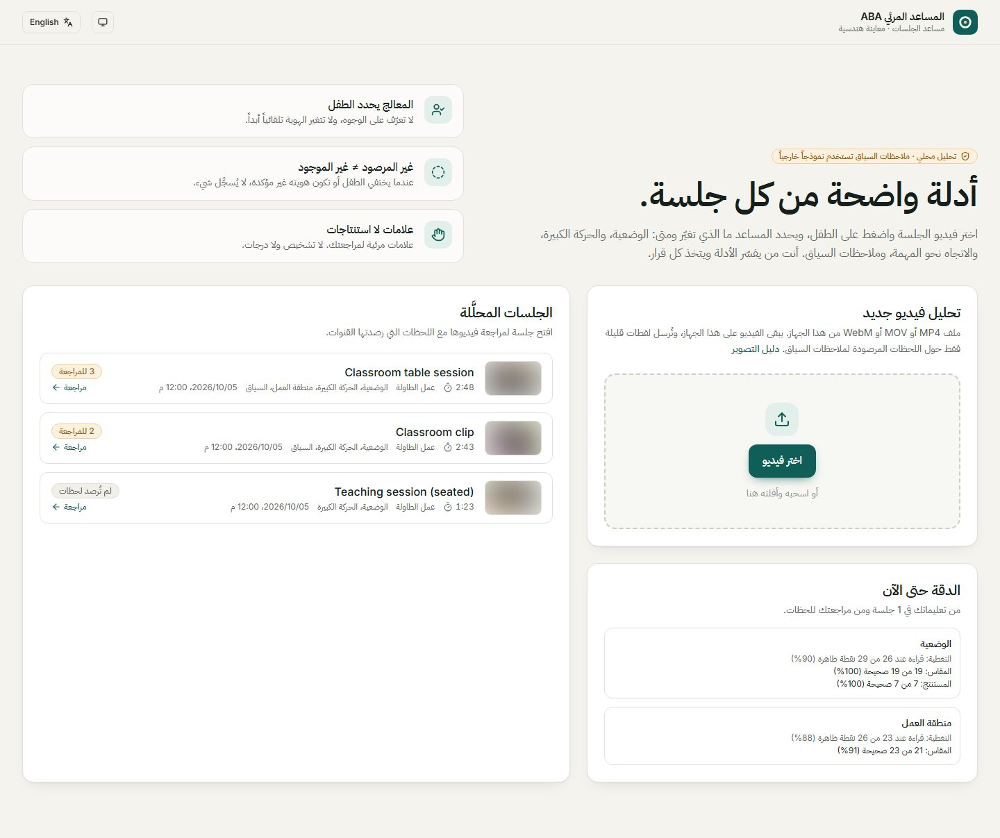
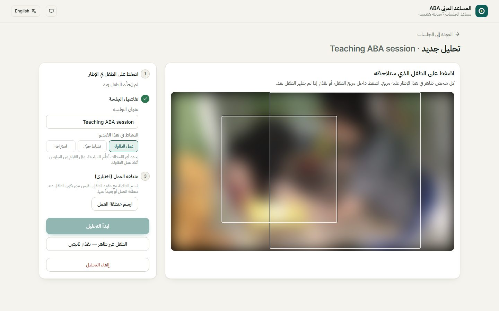
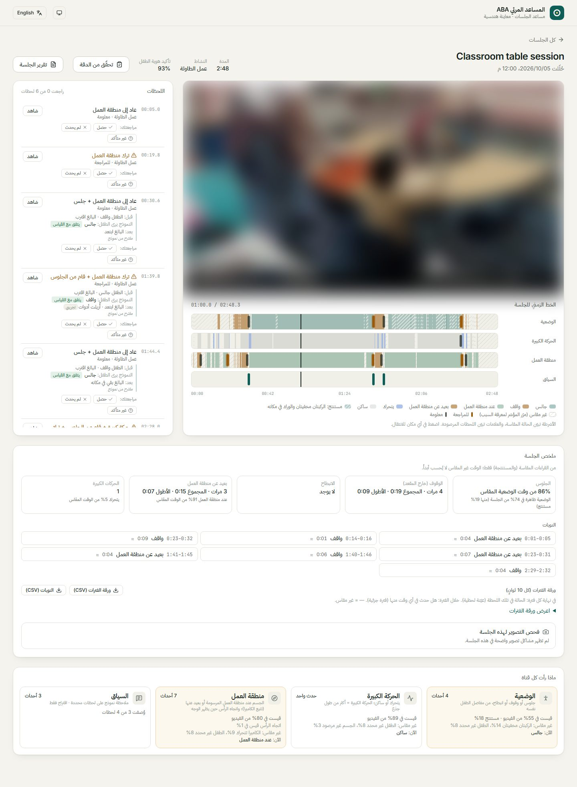
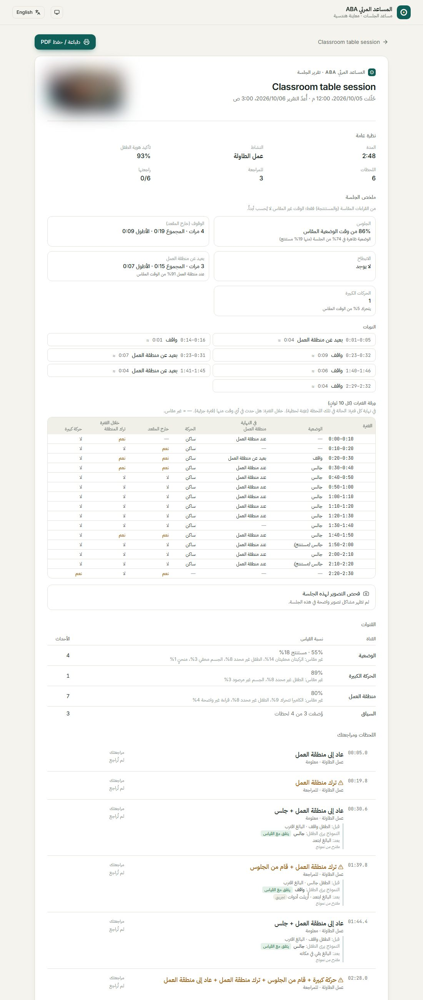
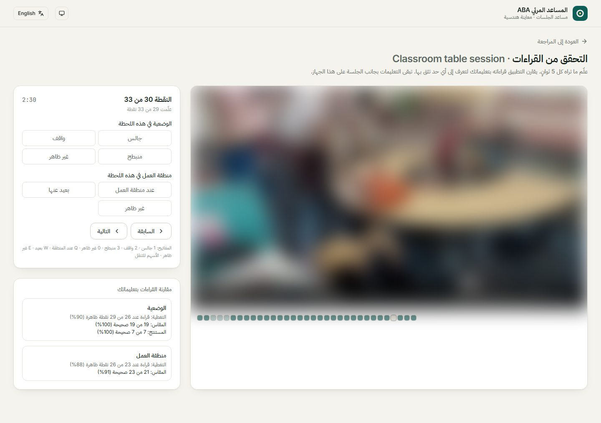
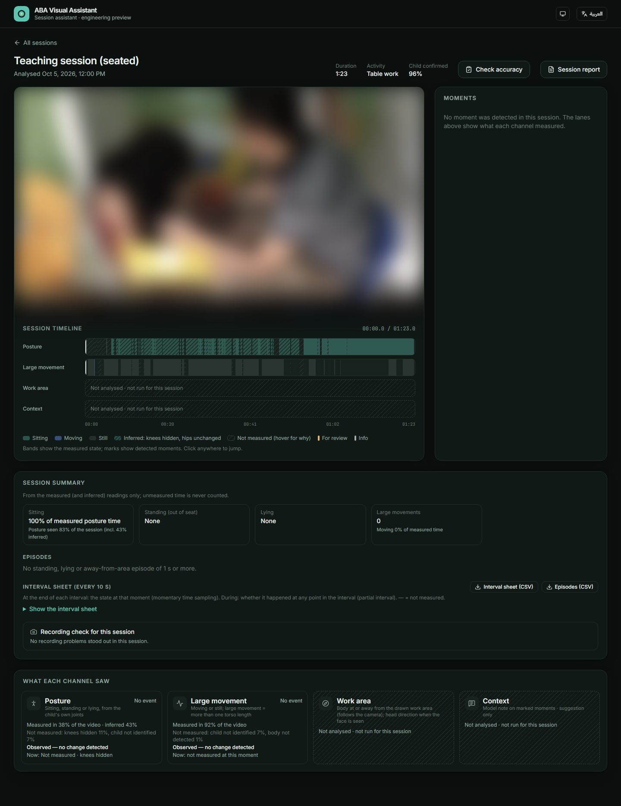

# المساعد المرئي ABA · ABA Visual Assistant

مساعد محلي يساعد المعالج على مراجعة فيديو جلسة ABA مسجّلة: يختار المعالج الطفل،
فيقيس البرنامج علامات قابلة للملاحظة (الجلوس والوقوف والانبطاح، الحركة الكبيرة،
القرب من منطقة العمل) ويعرضها على خط زمني مع ملخص بلغة جداول بيانات ABA.
**ليس أداة تشخيص**: البرنامج لا يحكم على الانتباه أو المشاعر أو النية، والمعالج هو
من يفسّر الأدلة ويتخذ كل قرار.

> English summary at the [end of this page](#english).



*صور هذه الصفحة مأخوذة من البرنامج، وطُمست فيها مقاطع الفيديو لحماية خصوصية الأطفال.*

---

## ماذا يفعل البرنامج

| الخطوة | ما يحدث |
|---|---|
| **1. رفع فيديو** | يُنسخ الفيديو إلى مجلد الجلسات على الجهاز نفسه. |
| **2. اختيار الطفل** | المعالج يضغط على الطفل في الإطار (لا تعرّف على الوجوه). يمكن رسم منطقة العمل (الطاولة مع مقعد الطفل). |
| **3. التحليل** | تتبّع الطفل، ثم قراءات محلية بالكامل، ثم ملاحظات سياق قصيرة حول اللحظات المرصودة فقط. |
| **4. المراجعة** | فيديو + خط زمني لكل قناة + قائمة اللحظات بجانب الفيديو + ملخص الجلسة. |
| **5. التقرير** | تقرير قابل للطباعة أو الحفظ PDF، وتصدير CSV لورقة الفترات والنوبات. |



### القنوات (القراءات)

- **الوضعية**: جالس / واقف / منبطح من مفاصل الطفل نفسه. حين تختفي الركبتان (خلف الطاولة مثلاً)
  ويبقى الورك في مكانه، تستمر آخر وضعية وتظهر بلون أفتح على أنها **مستنتجة**، ولا تصنع أحداثاً.
- **الحركة الكبيرة**: يتحرك أو ساكن طوال الجلسة، وحدث عند انتقال الجسم أكثر من طول جذع.
- **منطقة العمل**: هل الطفل عند الطاولة التي رسمها المعالج أو ابتعد عنها. المنطقة **تتبع الكاميرا**
  إذا تحركت، والوقوف بجانب المقعد لا يُعدّ تركاً للمنطقة (تسجّله الوضعية).
- **السياق** (اقتراح من نموذج): وصف قصير لما فعله البالغ قبل اللحظة وبعدها، ورأي ثانٍ يتحقق
  من القياس. لا يملأ أي قياس ناقص ولا يغيّر أي مستوى.

كل وقت غير مقاس يظهر **مع سببه** (الركبتان مخفيتان، الطفل غير محدد، الكاميرا تتحرك…)، ولا يُحسب
أبداً على أنه جلوس أو أي حالة أخرى.

### صفحة المراجعة



- **اللحظات** بجانب الفيديو؛ زر «شاهد» ينقل الفيديو إليها، وتُظلَّل اللحظة الجارية أثناء التشغيل.
- **مراجعتك** لكل لحظة: حصل / لم يحدث / غير متأكد + ملاحظة قصيرة، تُحفظ بجانب الجلسة.
- **ملخص الجلسة**: نسبة الجلوس من الوقت المقاس، عدد نوبات الوقوف والانبطاح والابتعاد عن المنطقة
  ومجموعها وأطولها، والحركات الكبيرة.
- **ورقة الفترات** (كل 10 ثوانٍ): الحالة في نهاية كل فترة (عيّنة لحظية) وهل حدث السلوك خلالها
  (فترة جزئية)، مع تنزيل CSV.
- **فحص التصوير**: نصائح للتسجيل القادم مبنية على أسباب الفجوات في هذه الجلسة.

### التقرير والتحقق من الدقة

| تقرير الجلسة (طباعة / PDF) | التحقق من الدقة |
|---|---|
|  |  |

في صفحة **«تحقّق من الدقة»** يعلّم المراجع ما يراه كل 5 ثوانٍ (بالأزرار أو المفاتيح 1/2/3/0 و Q/W/E)،
فيقارن البرنامج قراءاته بتعليماته: التغطية، ودقة القراءات المقاسة والمستنتجة كلٌّ على حدة.
تجمع بطاقة **«الدقة حتى الآن»** في الصفحة الرئيسية هذه النتائج مع مراجعات اللحظات.

الواجهة بالعربية والإنجليزية، مع مظهر فاتح وداكن:



---

## التثبيت

المتطلبات: **Windows 10/11** (أو Linux/macOS بالأوامر اليدوية أدناه)، **Python 3.11**،
**Node.js 20 أو أحدث**. بطاقة رسومات NVIDIA اختيارية؛ البرنامج يعمل على المعالج لكن التحليل أبطأ.

```bash
git clone https://github.com/f7a10/child-therapy-aba-demo.git
cd child-therapy-aba-demo
```

**1. بيئة Python والمكتبات**

```bash
python -m venv .venv
.venv\Scripts\python -m pip install -r requirements-live.txt -r requirements-demo-vision.txt
```

على Linux/macOS استخدم `.venv/bin/python` بدلاً من `.venv\Scripts\python`.
لتسريع التحليل ببطاقة NVIDIA ثبّت نسخة PyTorch المناسبة لـ CUDA من [pytorch.org](https://pytorch.org/get-started/locally/).

**2. نموذج تقدير الوضعية**

ضع الملف `yolo11s-pose.pt` في جذر المشروع. إن لم يكن موجوداً تحاول مكتبة Ultralytics تنزيله
عند أول تحليل (يحتاج اتصالاً بالإنترنت)، أو نزّله يدوياً من
[Ultralytics](https://docs.ultralytics.com/tasks/pose/).

**3. مفتاح ملاحظات السياق (اختياري)**

ملاحظات السياق ترسل لقطات قليلة حول اللحظات المرصودة فقط إلى نموذج عبر OpenRouter (مع رفض جمع
البيانات). لتفعيلها انسخ `.env.example` إلى `.env` وضع المفتاح:

```text
OPENROUTER_API_KEY=المفتاح هنا
```

بدون المفتاح يعمل كل شيء آخر محلياً، وتظهر قناة السياق «لم تُحلَّل». ملف `.env` مستثنى من Git؛
لا تشاركه.

**4. بناء الواجهة**

```bash
cd live-ui
npm ci
npm run build
cd ..
```

(`run_live.bat` يبني الواجهة تلقائياً في أول تشغيل إن لم تكن مبنية.)

## التشغيل

على Windows: انقر نقراً مزدوجاً على **`run_live.bat`**، فيفتح المتصفح على
<http://127.0.0.1:8767>. أغلق النافذة لإيقاف البرنامج.

أو يدوياً:

```bash
.venv\Scripts\python -m aba_demo.live --library "D:\ABA sessions"
```

| الخيار | المعنى |
|---|---|
| `--library DIR` | مجلد الجلسات المحلّلة (الافتراضي: `%USERPROFILE%\ABA Visual Assistant\sessions`). |
| `--port N` | المنفذ (الافتراضي 8767). |
| `--weights PATH` | مسار نموذج الوضعية. |

يعمل الخادم على الجهاز نفسه فقط (`127.0.0.1`)؛ لا تنشره كخدمة على الشبكة.

### نصائح التصوير

أفضل النتائج تأتي من: كاميرا **ثابتة على حامل**، **من الجانب** بزاوية 45° تقريباً وعلى ارتفاع الطفل،
وجسم الطفل **كاملاً** في الصورة بما فيه الساقان، والطاولة مع مقعد الطفل ظاهرة. الدليل الكامل في
البرنامج: الصفحة الرئيسية ← «دليل التصوير».

## الخصوصية

- الفيديو والقراءات ومراجعات المعالج تبقى في مجلد الجلسات على الجهاز، خارج هذا المستودع.
- لا يُرسل خارج الجهاز إلا لقطات قليلة حول كل لحظة مرصودة (حتى 4 لقطات) لقناة السياق، وفقط عند
  وجود مفتاح، مع سياسة رفض جمع البيانات وتثبيت المزوّد.
- لا ترفع تسجيلات أطفال أو معالجين، أو مخرجات التحليل، أو `.env`، أو أوزان النماذج إلى المستودع.

## الاختبارات

```bash
.venv\Scripts\python -m unittest discover -s tests -q
cd live-ui && npm test
```

الاختبارات منطقية وصناعية في معظمها، ولا تُغني عن قياس الدقة على فيديوهات حقيقية (صفحة «تحقّق من الدقة»).

## بنية المشروع

| المسار | المحتوى |
|---|---|
| `aba_demo/live/` | الخادم (FastAPI): رفع الفيديو، التحليل، مكتبة الجلسات، المراجعات والتعليمات. |
| `aba_demo/posture_*`، `large_movement_*`، `orientation_*` | القنوات المحلية: الخصائص، القارئ، والمخطط الصارم لكل قناة. |
| `aba_demo/context_v2*.py` | قناة السياق (اقتراح من نموذج) والرأي الثاني. |
| `aba_demo/session_measures.py` | النوبات وملخص الجلسة وورقة الفترات و CSV. |
| `aba_demo/reading_accuracy.py` | مقارنة القراءات بتعليمات المراجع، ونصائح التصوير. |
| `live-ui/` | الواجهة (React + Vite + Tailwind). |
| `tests/` | اختبارات Python. |

## حدود معروفة

- العتبات **مؤقتة** وضُبطت على عدد قليل من الفيديوهات؛ قِس الدقة على فيديوهاتك قبل الاعتماد عليها.
- التصوير القريب من الأمام يضعف قراءة الوضعية (الركبتان مخفيتان أو مضغوطتان في الصورة).
- منطقة العمل تتبع الكاميرا، لكن الحركة الكبيرة جداً للكاميرا قد تفقدها مؤقتاً (تظهر «غير مقاس»).
- لا تعرّف على الهوية بين الجلسات، ولا تحليل مباشر من كاميرا حيّة.

## الفريق

- **فهد** — [@f7a10](https://github.com/f7a10)
- **صالح** — [@Salih2369](https://github.com/Salih2369)

---

<a id="english"></a>

## English

A local assistant for reviewing a recorded ABA session. The therapist selects the child; the app
measures **observable signs only** — sitting / standing / lying (with an *inferred* posture while
only the knees are hidden), moving / still and large movements, and at / away from a drawn work area
that follows the camera — and shows them on a timeline with ABA-style measures: episodes with
durations, a session summary, a 10-second interval sheet (momentary time sampling and partial
interval) and CSV export. Every unmeasured stretch is shown with its reason. An optional context
channel sends a few frames around detected moments to a model through OpenRouter (data collection
denied) for a short, clearly labelled suggestion and a second opinion; it never fills measurements.
The therapist marks each moment (happened / did not happen / unsure), prints a session report, and
can label the child every 5 seconds to measure how accurate the readings are.

**Not a diagnostic tool** — no judgements of attention, emotion or intent; the therapist decides.

**Install:** Python 3.11, Node.js 20+.

```bash
python -m venv .venv
.venv\Scripts\python -m pip install -r requirements-live.txt -r requirements-demo-vision.txt
cd live-ui && npm ci && npm run build && cd ..
```

Put `yolo11s-pose.pt` in the repository root (Ultralytics tries to download it on first use).
Optionally copy `.env.example` to `.env` and set `OPENROUTER_API_KEY` for context notes.

**Run:** double-click `run_live.bat` (Windows) or
`python -m aba_demo.live --library <sessions folder>`, then open <http://127.0.0.1:8767>.
The server listens on loopback only. Session videos, readings and reviews stay in the sessions
folder, outside the repository.

Earlier components (the precomputed replay dashboard `python -m aba_demo.server`, the Colab notebook
in `notebooks/`) are still included; see [LIVE_WORKSTREAM.md](LIVE_WORKSTREAM.md) for the history.

**Team:** Fahad ([@f7a10](https://github.com/f7a10)) and Saleh ([@Salih2369](https://github.com/Salih2369)).
