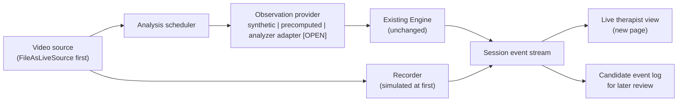
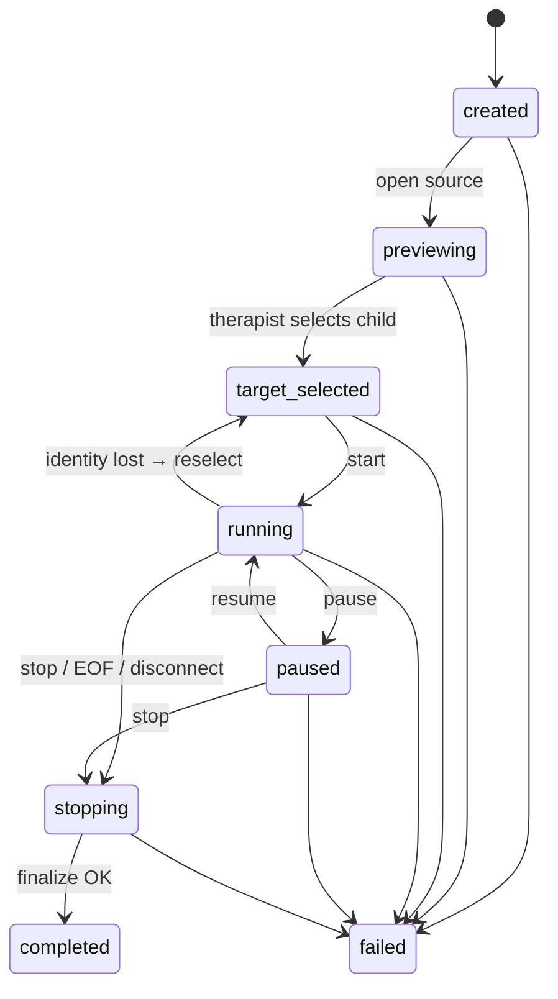

# Live Session Application — Design Proposal (Draft)

**Status: design only. Nothing described here is implemented.** This document
proposes how a live-session layer could be built around the existing
recorded-video demo. It adds no code, no camera support, no recorder, and no new
API. All JSON below is a synthetic shape example, not a real detection.

Open points are marked **[OPEN]** with a proposed decision owner.

---

## 1. Goals and non-goals

**Goals (this workstream)**

- A separate live-session shell: session lifecycle, video source abstraction,
  recording status, event delivery, and a therapist-facing live view.
- Start with **file-as-live** (a local file played at real-time pace) and a
  clearly labeled **synthetic observation provider**.
- Reuse the existing `Engine` unchanged for indicator states and candidate
  alerts.
- Make every failure and uncertainty visible; never show a stale or fabricated
  result as current.

**Non-goals (not in this PR or the next implementation PRs)**

- No change to `vision.py`, `engine.py`, `server.py`, `static/index.html`,
  schemas, context, review, or export behavior.
- No camera capture, no real-footage processing, no external provider calls.
- No claim of live inference, live latency, or clinical validity.
- No new clinical wording; alert text stays as it is today until reviewed.

---

## 2. What the current code supports (observed on `main` @ `606363a`)

| Component | Relevant behavior | Consequence for live work |
| --- | --- | --- |
| `engine.Engine` | Pure, no I/O; strictly increasing `time`; returns per-indicator state (`unobservable`, `not_applicable`, `inactive`, `candidate`, `active`), events, and at most one `alert`. Not thread-safe. | Reusable as-is. One engine per session, owned by one worker. |
| `vision.VideoAnalyzer` | Constructor requires an existing local **file** (rejects URLs/cameras). Time = `frame_index / nominal fps`. `analyze(t)` is forward-only and runs tracking on **every** frame up to `t`. Raises `EOFError` at end. | File-as-live with the real analyzer is possible in principle; camera input is not. Skipping frames before the tracker is not supported. |
| `vision.TargetLock` | Human selection; only the same track ID may recover within a bounded gap; otherwise `uncertain` with a reason code. | Live UI must surface the reason and offer explicit reselection. |
| `server.py` | Single global engine/analyzer, loopback-only, token-protected, request/response only. | Not suitable as a multi-session or push transport. Live shell gets its own entry point. |
| `static/index.html` | Accepts only `mode: "precomputed"` data; replays rows causally. | Live view is a separate page; replay page stays untouched. |

Test baseline: `python -m unittest discover -s tests -q` → **172 tests OK**
(Python 3.13.5, Pillow 11.1.0, Node 24.11.0, Windows 11).

---

## 3. Proposed architecture



Principles:

1. **Recording is independent of analysis.** A slow provider must never cause
   recorded frames to be dropped.
2. **Providers are swappable and labeled.** Every observation carries its
   provider kind (`synthetic`, `precomputed`, `analyzer`) so the UI can never
   present a fixture as live inference.
3. **The Engine is the only source of alerts.** The UI never raises an alert
   because a signal became `true`.
4. **New code lives in a new package** (proposed `aba_demo/live/`) with its own
   tests and its own local entry point. Existing modules are imported, not
   edited.

Proposed modules (names are proposals):

| Module | Responsibility |
| --- | --- |
| `live/source.py` | `open / read / close`; yields frame, source frame index, video time, capture monotonic time. `FileAsLiveSource` first. |
| `live/providers.py` | `SyntheticProvider`, `PrecomputedProvider` (reads an existing export), later an analyzer adapter. |
| `live/session.py` | State machine, one `Engine` per session, transition checks, termination reasons. |
| `live/recorder.py` | Simulated recorder first; real recorder only after the data-governance gate. |
| `live/events.py` | Event envelope construction and validation. |
| `live/server.py` + `live/static/` | Separate local entry point and live page. |

---

## 4. Session lifecycle



Rules:

- No observations are produced before `target_selected`.
- Every transition checks the allowed previous state; an invalid transition is
  rejected and logged, never silently applied.
- Cleanup (release source, stop workers, close recorder) is idempotent and runs
  on `completed` and `failed`.
- A session using the simulated recorder or a fixture provider ends as
  `completed (simulation)`, never as a recorded session.
- Termination reasons are distinct: `user_stop`, `source_eof`,
  `source_disconnected`, `recorder_failed`, `worker_failed`.

**[OPEN — product + privacy]** Does pause stop recording, or only analysis/UI?
What is shown while paused? Are preview frames recorded?

---

## 5. Failure and uncertainty behavior

| Situation | What the therapist sees | Engine / data effect | Test (synthetic) |
| --- | --- | --- | --- |
| Child occluded / lost | "Identity uncertain" + reason; all five indicators "not observable" | Row has `identity: uncertain`, all signals `null`; no target switch | Multi-person fixture with dropout |
| Different track ID appears | Prompt to reselect; no automatic switch | Stays `uncertain` until explicit reselection | Fixture with ID reassignment |
| File EOF | "Source ended" | Session → `stopping` with `source_eof`; no looping | Short fixture file |
| Source disconnect | "Source unavailable" | Stop with `source_disconnected`; last result marked stale | Forced read error |
| Provider slower than real time | Result age shown; stale results marked | Recording continues; analysis lag counted | Slow fake provider |
| Provider exception | "Analysis unavailable" | No observation emitted for that period; error event | Raising fake provider |
| Recorder failure / disk full | Session failed, clearly stated | No `completed` claim | Injected write error |
| Pause / resume | No results with time inside the pause shown as new | Ordering preserved | Transition ordering test |
| Stop | Final summary; resources released | Recorder finalized and verified before `completed` | Restart after stop |

---

## 6. Feasibility: can the current analyzer run "live"?

**Question.** With file-as-live pacing, can `VideoAnalyzer.analyze(elapsed)`
keep up with wall-clock time, and what happens when it cannot?

**What the code tells us already**

- `analyze(t)` processes every frame between the last request and `t`. If
  pose tracking costs more than `1 / fps` per frame, lag grows without bound.
- Dropping frames before the tracker would break the continuity assumptions of
  `TargetLock` and the tracker's `persist=True` state, so it is **not** an
  option without a redesign reviewed by the analysis owner.
- Time is nominal-FPS based; variable-frame-rate files and camera clocks are
  unsupported.

**Proposed experiment (no code changes to `vision.py`)**

1. Wrap the analyzer in a small benchmark script outside the package.
2. Drive `analyze(t)` from a monotonic clock at 5 Hz for a short authorized or
   synthetic clip.
3. Record per call: requested time, returned time, frames processed, processing
   milliseconds, and lag (`wall_elapsed − returned_time`).
4. Report p50/p95 per-frame cost and whether lag stays bounded, per hardware.

**Blocker [OPEN — analysis owner + privacy]** Our synthetic color-pattern
fixtures contain no people, so YOLO will detect nobody and no target can be
selected. A meaningful run needs either authorized footage on approved hardware
or a person-like synthetic clip. Until then the experiment can only measure raw
per-frame cost.

**Possible outcomes**

- Keeps up → an adapter can call `analyze` directly for file-as-live.
- Does not keep up → options include a lower `imgsz`, GPU hardware, or a new
  frame-fed analyzer API. Any of these needs joint review.

---

## 7. Event envelope (discussion example, not a schema)

Wraps the existing observation row **unchanged**:

```json
{
  "schema_version": 1,
  "event_type": "observation",
  "session_id": "synthetic-session-001",
  "sequence": 42,
  "provider": "synthetic",
  "source_frame_index": 124,
  "video_time": 12.4,
  "captured_monotonic_ms": 50012.0,
  "processed_monotonic_ms": 50345.0,
  "observation": {
    "time": 12.4,
    "identity": "uncertain",
    "signals": {
      "orientation": null,
      "body_motion": null,
      "out_of_seat": null,
      "hand_motion": null,
      "posture_change": null
    },
    "values": {}
  }
}
```

Other proposed `event_type` values: `session_state`, `identity_state`,
`engine_state` (the `Engine.update` snapshot, including `alert`),
`recording_status`, `performance`, `error`.

Rules:

- `video_time` is evidence time and is never shifted. Monotonic fields only
  measure latency within one process.
- `sequence` is strictly increasing per session so the UI can detect gaps and
  duplicates.
- This envelope is **not** the precomputed export format and must not be saved
  as one.

**[OPEN — both owners]** Transport (Server-Sent Events vs WebSocket), sequence
and reconnect rules, and whether this becomes a versioned contract.

---

## 8. Live view (synthetic mock-up description)

A new page, separate from the replay dashboard:

- Header badge that always states the provider: **SIMULATION — synthetic
  observations**, **PRECOMPUTED**, or (later) **LIVE ANALYSIS**.
- Video area with the selected target box and a reselect button.
- Session bar: state, elapsed time, recording status (simulated/real/failed).
- Identity strip: confirmed / uncertain + reason code.
- Five indicator tiles using the Engine states; "not observable" shown
  distinctly from "inactive".
- One peripheral candidate card at a time, with its evidence time; cleared or
  marked unavailable on identity loss or staleness.
- Latency and result age only when actually measured.

No severity colors, no diagnostic or intent language. **[OPEN — clinical
reviewer]** card wording and interruption level.

---

## 9. Test plan

All tests GPU-free and run with the existing command
`python -m unittest discover -s tests -q`.

| Area | Tests |
| --- | --- |
| Source | File-as-live pacing uses a fake clock; EOF produces `source_eof`; read error produces `source_disconnected`. |
| Session | Every allowed transition; every disallowed transition rejected; idempotent cleanup; no observation before target selection. |
| Providers | Synthetic rows are labeled; uncertain rows carry five `null` signals; times strictly increase. |
| Engine integration | Alerts only from `Engine.update`; out-of-seat suppression respected; identity loss clears/marks the current card. |
| Scheduler | Slow provider: lag and drop counters grow, recording unaffected; failing provider: error event, no fabricated row. |
| Recorder (simulated) | Failure injection yields `failed`, never `completed`. |
| Events | Envelope validation; sequence monotonic; no future `video_time` emitted. |
| Regression | Existing 172 tests still pass; replay page and `server.py` unchanged. |

---

## Open decisions and owners

| # | Decision | Proposed owner |
| --- | --- | --- |
| 1 | Module and UI boundaries (`aba_demo/live/`, separate entry point) | Analysis owner approves |
| 2 | Analyzer adapter approach after the feasibility experiment | Analysis owner + live owner |
| 3 | Event envelope fields, transport, versioning | Both owners |
| 4 | Pause and preview recording semantics | Product + privacy authority |
| 5 | Recorder codec, location, retention, access | Organizational privacy authority |
| 6 | Browser vs native camera capture | Both owners, after a spike |
| 7 | Alert card wording and interruption level | Clinical reviewer |
| 8 | Live latency and false-alert acceptance targets | Clinical + product |

## Proposed implementation sequence (after this design is accepted)

1. `FileAsLiveSource` + `SyntheticProvider` + session state machine + tests.
2. Live page and event stream showing synthetic data, clearly labeled.
3. Simulated recorder with failure injection.
4. Scheduler with lag/stale metrics and slow/failing provider tests.
5. Analyzer adapter — only after the feasibility results and joint review.
