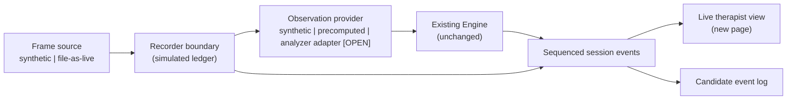
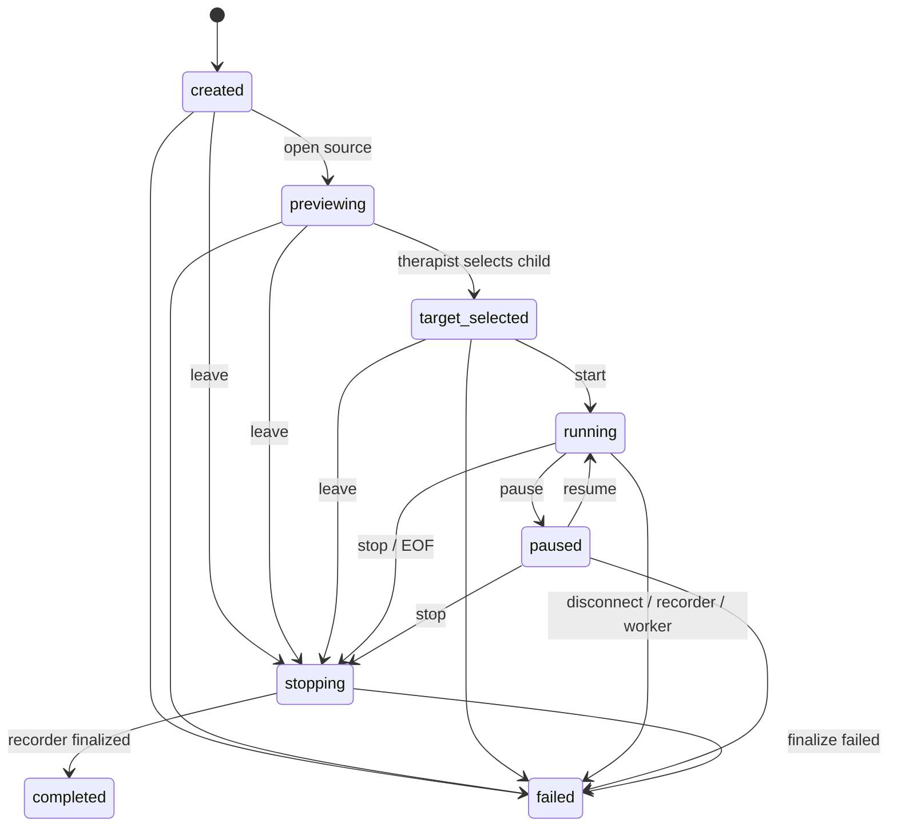

# Live Session Application — Design Proposal

**Status: proposal for review. Nothing here is accepted until the analysis
owner approves it.** This document proposes how a live-session layer could be
built around the existing recorded-video demo. It changes no existing module,
schema, or behavior. All JSON below is a synthetic shape example, not a real
detection.

A **reference prototype** of this design exists on stacked draft branches (see
[§10](#10-reference-prototype-draft-pending-acceptance)). It was built to test
the design's feasibility with synthetic data only. It is offered for
evaluation, not as a decision: every technology and interface choice in it is
a proposal that can be changed or discarded after review.

Open points are marked **[OPEN]** with a proposed decision owner.

---

## 1. Goals and non-goals

**Goals (this workstream)**

- A separate live-session shell: session lifecycle, video source abstraction,
  recording boundary, event delivery, and a therapist-facing live view.
- Start with **file-as-live** (a local file played at real-time pace) plus a
  clearly labeled **synthetic observation provider** and a **precomputed
  provider** that replays existing exports.
- Reuse the existing `Engine` unchanged for indicator states and candidate
  alerts.
- Make every failure, delay and uncertainty visible; never show a stale or
  fabricated result as current.

**Non-goals**

- No change to `vision.py`, `engine.py`, `server.py`, `static/index.html`,
  export, context or review behavior, or any shared schema.
- No camera capture, no real-footage processing, no external provider calls,
  no real recording.
- No claim of live inference, live latency, or clinical validity.
- No new clinical wording without clinician review (see [§8](#8-live-view)).

---

## 2. What the current code supports (observed on `main` @ `606363a`)

| Component | Relevant behavior | Consequence for live work |
| --- | --- | --- |
| `engine.Engine` | Pure, no I/O; strictly increasing `time`; per-indicator states (`unobservable`, `not_applicable`, `inactive`, `candidate`, `active`), events, at most one `alert`. Not thread-safe. | Reusable as-is. One engine per session, accessed by one worker at a time. |
| `vision.VideoAnalyzer` | Requires an existing local **file** (rejects URLs/cameras). Time = `frame_index / nominal fps`. `analyze(t)` is forward-only and tracks **every** frame up to `t`. Raises `EOFError` at end. | File-as-live with the real analyzer is possible in principle; camera input is not. Skipping frames before the tracker is not supported. |
| `vision.TargetLock` | Human selection; only the same track ID may recover within a bounded gap; otherwise `uncertain` with a reason code. | Live UI must surface the reason and require explicit reselection. |
| `export.export_video` | Writes `schema_version: 1`, `mode: "precomputed"`, `source.sha256`, ordered `observations`. | A precomputed provider can replay these rows against the matching video without touching the analyzer. |
| `server.py` | Single global engine/analyzer, loopback-only, token-protected, request/response only. | Not a multi-session or push transport. The live shell gets its own entry point. |
| `static/index.html` | Accepts only `mode: "precomputed"` data; replays rows causally. | The live view is a separate page; the replay page stays untouched. |

---

## 3. Proposed architecture



Principles:

1. **Recording is independent of analysis.** Each due frame reaches the
   recorder before analysis; analysis failures or slowness never remove frames
   from the recording.
2. **No frame is skipped before the provider.** When analysis is slower than
   real time, results age and are marked **stale**; they are never shown as
   current. Any drop policy is a joint decision (see [§6](#6-feasibility-and-analysis-lag)).
3. **Providers are swappable and labeled.** Every event carries the provider
   kind (`synthetic`, `precomputed`, later `analyzer`) so a fixture can never
   be presented as live inference.
4. **The Engine is the only source of alerts.** The UI never raises an alert
   because a signal became `true`.
5. **New code lives in a new package** (proposed `aba_demo/live/`) with its
   own tests and entry point. Existing modules are imported, not edited.

Provider protocol (proposal): `observe(frame) -> list[observation]` returns
every existing-shape row that became due at or before the frame's video time,
possibly none, in strictly increasing time, or raises a provider error for
that frame. A row from the future or an uncertain row with non-null signals is
a contract violation that fails the worker.

---

## 4. Session lifecycle



Rules:

- No observations before `target_selected`.
- Every transition checks the allowed previous state; invalid transitions are
  rejected, never silently applied.
- Cleanup (release source, close recorder) is idempotent and runs on both
  terminal states.
- Termination reasons are distinct: `user_stop`, `user_left`, `source_eof`,
  `source_disconnected`, `recorder_failed`, `worker_failed`, `server_shutdown`.
- A session is `completed` only after the recorder finalizes and verifies;
  a finalize failure ends in `failed`. Completion events always state
  `simulation: true, recorded: false` until a real recorder exists.

**[OPEN — product + privacy]** Does pause stop recording, or only analysis/UI?
What is shown while paused? Are preview frames recorded? (In the prototype no
frame becomes due while paused, so nothing reaches the recorder.)

---

## 5. Failure and uncertainty behavior

| Situation | What the therapist sees | Data effect | Test (synthetic) |
| --- | --- | --- | --- |
| Child occluded / lost | "Identity uncertain"; five indicators "not observable"; card unavailable | `identity: uncertain`, five `null` signals; no target switch | Occlusion script |
| File EOF | "Source reached its end" | `stopping → completed` with `source_eof` | Short fixture |
| Source disconnect | Session failed, clearly stated | `failed` with `source_disconnected`; no further results | Injected disconnect |
| Analysis slower than real time | "Analysis is N s behind live"; results labeled late | Recording continues; no frames skipped; stale results never shown as current | Provider with simulated cost |
| Provider error on a frame | "Analysis unavailable" in the log | No row fabricated; engine sees a gap | Injected provider failure |
| Recorder write failure / disk full | Session failed; "no complete ledger produced" | `failed` with `recorder_failed`; no completion claim | Injected write failure |
| Recorder finalize failure | Session failed | `stopping → failed` | Injected finalize failure |
| Event stream interrupted | Stale banner; last state dimmed | Client resumes by sequence number | Server restart |
| Session gone on server | "Session no longer available" + new-session action | Definitive close code, no endless retries | Unknown session id |
| Leaving mid-session | Confirmation dialog | Session ends on the server (`user_left`) | Leave while running |

---

## 6. Feasibility and analysis lag

**Question.** With file-as-live pacing, can `VideoAnalyzer.analyze(elapsed)`
keep up with wall-clock time, and what happens when it cannot?

**What the code tells us**

- `analyze(t)` processes every frame between requests. If pose tracking costs
  more than `1 / fps` per frame, lag grows without bound.
- Dropping frames before the tracker would break `TargetLock` continuity and
  the tracker's `persist=True` state; it is **not** an option without a
  redesign reviewed by the analysis owner.
- Time is nominal-FPS based; VFR files and camera clocks are unsupported.

**What the prototype measures today (synthetic only).** Per-frame provider
cost (p50/p95/max), result age relative to the session clock, and stale
count, emitted as periodic `performance` events. A synthetic provider with a
simulated per-frame cost demonstrates growing lag; nothing is skipped.

**Proposed next experiment (no change to `vision.py`)**: wrap the analyzer as a
provider outside the package, drive it with the file-as-live source on
approved hardware, and report p50/p95 per-frame cost and whether age stays
bounded.

**Blocker [OPEN — analysis owner + privacy]** Synthetic color-pattern videos
contain no people, so YOLO cannot select a target. A meaningful run needs
authorized footage on approved hardware or a person-like synthetic clip.

---

## 7. Event envelope (proposal, not a shipped schema)

Wraps the existing observation row **unchanged**:

```json
{
  "schema_version": 1,
  "event_type": "observation",
  "session_id": "synthetic-session-001",
  "sequence": 42,
  "provider": "synthetic",
  "monotonic_ms": 50345.0,
  "source_frame_index": 124,
  "video_time": 12.4,
  "captured_monotonic_ms": 50012.0,
  "processed_monotonic_ms": 50345.0,
  "age_s": 0.03,
  "stale": false,
  "observation": {
    "time": 12.4,
    "identity": "uncertain",
    "signals": {
      "orientation": null,
      "body_motion": null,
      "out_of_seat": null,
      "hand_motion": null,
      "posture_change": null
    },
    "values": {}
  }
}
```

Other `event_type` values: `session_state`, `identity_state`, `engine_state`
(the `Engine.update` snapshot, including `alert`), `recording_status`,
`performance`, `activity`, `error`.

Rules: `video_time` is evidence time and is never shifted; monotonic fields
only measure latency within one process; `sequence` is strictly increasing
per session so clients detect gaps and duplicates and resume with
`after=<sequence>`. This envelope is **not** the precomputed export format.

---

## 8. Live view

A separate page from the replay dashboard. Principles implemented in the
prototype:

- The data origin is always visible: **SIMULATION** or **PRECOMPUTED
  REPLAY** badge, source label on the stage, summary at the end.
- Explicit target locking before observation; identity state always shown.
- "Not observable" is visually distinct from "observed · none".
- One peripheral candidate card at a time, only from the Engine's alert; it is
  withdrawn on identity loss, stream interruption, late analysis, or session
  end.
- Attention uses amber; red is reserved for system failures, never behavior.
- Ending or leaving a running session requires confirmation.
- Respects reduced-motion and light/dark preferences; keyboard operable.

**[OPEN — clinical reviewer]** All therapist-facing text needs review before
any real use, in particular: indicator names and one-line bases, state labels
("Sustained", "Building", "Observed · none", "Not observable"), the candidate
card wording ("Candidate observation", "prompt for your review, not a
conclusion about attention, intent, or behavior function"), and whether a card
should interrupt at all.

---

## 9. Test plan

All tests are GPU-free and run with `python -m unittest discover -s tests -v`.
API tests skip without `requirements-live.txt`; file-as-live tests skip
without OpenCV. Frontend reducer tests run with `npm test` in `live-ui/`.

| Area | Covered in prototype |
| --- | --- |
| Source | Pacing with a fake clock; EOF; injected disconnect; real file decode of a generated synthetic video. |
| Session | Allowed and disallowed transitions; leave before start; idempotent cleanup; no observations before start; pause freezes the clock. |
| Providers | Synthetic labeling and null semantics; precomputed validation (schema, SHA binding, ordering, uncertain nulls, strict JSON); causal emission. |
| Engine integration | Alerts only from `Engine.update`; identity loss clears the card. |
| Recorder | Ledger counts every due frame even when analysis fails; gaps counted; write and finalize failures never complete. |
| Lag | Slow provider: contiguous frames, growing age, stale marking, performance events. |
| API | Lifecycle over HTTP, validation, host/origin checks, capacity and discard, WebSocket backlog and resume, definitive close for unknown sessions. |
| UI state | Duplicates ignored, gaps flagged, stale candidates never current, unknown events ignored. |
| Regression | The existing suite is unchanged and passes. |

---

## 10. Reference prototype (draft, pending acceptance)

Offered as stacked draft PRs so each layer can be reviewed, changed, or
rejected independently:

| Draft PR | Contents | New dependencies |
| --- | --- | --- |
| 1. Live core | `aba_demo/live/` source, providers, recorder ledger, session, scenarios + tests | None (OpenCV optional for file-as-live) |
| 2. Local API | Asyncio runtime, HTTP + WebSocket API, `python -m aba_demo.live` | `requirements-live.txt` |
| 3. Live view | `live-ui/` page | Node toolchain, built locally |

**Technology choices made for the prototype — all [OPEN — both owners]:**

- **Transport:** WebSocket with sequence-based resume. Alternative:
  Server-Sent Events over the standard library, which would avoid new Python
  dependencies.
- **Backend framework:** FastAPI + Uvicorn. Alternative: extend the
  standard-library approach used by `server.py` in a separate module.
- **Frontend:** React + TypeScript + Vite + Tailwind, fonts bundled locally
  (no third-party requests). Alternative: a single static page like the
  existing dashboard. Note: the repository `.gitignore` ignores `*.json`, so
  `package.json`, `package-lock.json` and `tsconfig.json` were added
  explicitly after review.

**Findings to share with the analysis owner (no change made to their code):**

- `Engine` persistence accumulates float deltas, so a 2.0 s threshold at
  5 Hz triggers one sample late (`0.2 × 10 < 2.0` in binary floating point):
  the first candidate appears at 8.4 s instead of 8.2 s in a synthetic run.
- `test_demo_server.ServerTests.test_context_validate_rejects_invalid_headers_json_schema_and_security`
  failed once on Windows (1 of 6 full-suite runs on the prototype branch, 0 of
  5 on `main`, 0 of 12 targeted reruns of that test module). The test does not
  import the live package; it may be timing-dependent.

---

## Open decisions and owners

| # | Decision | Proposed owner |
| --- | --- | --- |
| 1 | Module and UI boundaries (`aba_demo/live/`, separate entry point) | Analysis owner approves |
| 2 | Provider protocol and analyzer adapter approach after the lag experiment | Analysis owner + live owner |
| 3 | Event envelope fields, transport, versioning | Both owners |
| 4 | Stale threshold (prototype: 1.0 s) and whether any drop policy is allowed | Both owners |
| 5 | Pause and preview recording semantics | Product + privacy authority |
| 6 | Real recorder: codec, location, retention, access | Organizational privacy authority |
| 7 | Browser vs native camera capture | Both owners, after a spike |
| 8 | Therapist-facing wording and interruption level | Clinical reviewer |
| 9 | Live latency and false-alert acceptance targets | Clinical + product |
| 10 | Backend and frontend technology (see §10) | Both owners |
